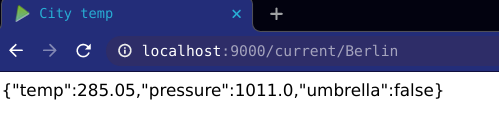

# Weather App

This project consists of a simple weather application which will provide an API for the user to interact with to get data.

### Sample input and output



## Setup steps
1. Download scala and sbt
2. Enter the weather-app folder and run following command
```sbt run```
3. App will be running at `http://localhost:9000`
4. To check its run try `http://localhost:9000/current/<city_name>`. Replace `<city_name>` with city of desired choice
5. To run the test cases, run the command ```sbt test```

## Approach
1. Downloaded sample hello-world app from play
2. Modified the API to print a different output
3. Created an account in openweathermap to obtain the API key required to access the weather APIs
4. After obtaining the API key, wrote logic to get data from a given URL 
5. Parameterized the city part in the URL, that it would be received from user
6. Parsed the incoming json and extracted relevant data i.e., temp, pressure, weather
7. Based on weather state, Umbrella flag was set whenever it was Rain/Drizzle/Thunder storm
8. Packed all relevant data into a case class and made it as a json string using Google's gson library
9. Lastly passed the final json string to views file and defined the route to call this method in `/conf/routes` file

## What can be improved?
1. Error handling at the moment is just printing out the exceptions on the screen, they can be made more user friendly and specific. For example `City could not be found error` when we enter a city which was not available in weather API
